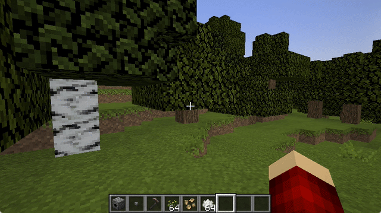

# CoordsDB
A plugin for saving coordinates for the Paper Minecraft Server.

Have you ever found yourself hitting F3 to get into that cluttered debug menu to save the coordinates of an important place such as your home base or nether portal? Maybe you have a whole album of screenshots or a Google Doc with all your coordinates. What if, there was a simpler in-game solution for saving your coordinates and getting easily all without leaving your game by using a few simple commands? 

That is why I created this plugin.

## Supported Platforms
- 1.19 Paper Minecraft Server

## How to use
### `/coords:set <label>` 
Sets and stores your current coordinate location with an optional label. 
#### Example
`/coords:set home` 

### `/coords:get` 
Gets all your coordinates.
#### Example
`/coords:get` 

### `/coords:get <label>` 
Gets with coordinate with the label.
#### Example
`/coords:get end_portal` 

### `/coords:get <prefix>*` 
Gets all your coordinates whose label begin with the prefix.
#### Example
`/coords:get i*` 

### `/coords:get <player>:<label>` 
Gets with coordinate with the label that belogs to that player.
#### Example
`/coords:get foo:bar` 

### `/coords:del <label>` 
Deletes the coordinate location with the specified label.
#### Example
`/coords:del spawn` 